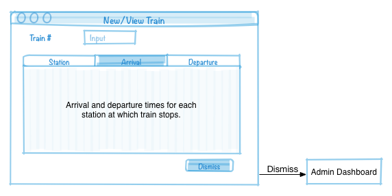

# Super Nouveaux Chemins pour la France (SNCF)

You are a database developer at [SNCF](http://www.sncf.com/), the French national rail company. Management has decided to implement a new train reservation system for customers that not only allows customers to book trips and administrators to edit routes, but allows management to enter trains that are cancelled due to strikes by the [CGT](http://www.cgt.fr/) and have customers' trips automatically rerouted.

## User Interface (UI) Mock-up

Following is a list of mockups of the screens that make up the database application (the user documents, using terminology from our [conceptual design process](../slides/conceptual-design-process.pdf)), with UI flow arrows and textual descriptions. You can derive an EER diagram, semantic constraints, information flow diagram, relational model, SQL statements, and the application itself from these mock-ups and descriptions. Please note that these are low-fidelity mock-ups. Your UI will likely (and probobly should) look different.

### Login

<table>
<tr>
<td width="50%" valign="top">

</td>
<td width="50%" valign="top">
A user account is required to access the system, so the database must maintain user account information such as a user's name and email address. Some users will have administrative rights to the system in order to add and edit train information -- including cancellations due to les grèves (strikes) -- and get passenger manifests.
</td>
</tr>
</table>

### Registration

<table>
<tr>
<td width="50%" valign="top">

</td>
<td width="50%" valign="top">
Items marked with a * are required.
Email is unique. Credit card is unique.
</td>
</tr>
</table>

### Administrator Dashboard

<table>
<tr>
<td width="50%" valign="top">

</td>
<td width="50%" valign="top">

</td>
</tr>
</table>

### Edit Train (Route)

<table>
<tr>
<td width="50%" valign="top">

</td>
<td width="50%" valign="top">
Dates of cancellation due to strikes.
</td>
</tr>
</table>

### Passenger Manifest

<table>
<tr>
<td width="50%" valign="top">

</td>
<td width="50%" valign="top">

</td>
</tr>
</table>

### Customer Dashboard

<table>
<tr>
<td width="50%" valign="top">

</td>
<td width="50%" valign="top">

</td>
</tr>
</table>

### Search Trips

<table>
<tr>
<td width="50%" valign="top">

</td>
<td width="50%" valign="top">

</td>
</tr>
</table>

### Book Trip

<table>
<tr>
<td width="50%" valign="top">

</td>
<td width="50%" valign="top">

</td>
</tr>
</table>

### Enter Passenger Infomation

<table>
<tr>
<td width="50%" valign="top">

</td>
<td width="50%" valign="top">

</td>
</tr>
</table>

### Pay for Trip

<table>
<tr>
<td width="50%" valign="top">

</td>
<td width="50%" valign="top">

</td>
</tr>
</table>

### Check Trip Status

<table>
<tr>
<td width="50%" valign="top">

</td>
<td width="50%" valign="top">

</td>
</tr>
</table>
