# Super Nouveaux Chemins de Fer Français (SNCF)

You are a database developer at [SNCF](http://www.sncf.com/), the French national rail company. Management has decided to implement a new train reservation system for customers that not only allows customers to book trips and administrators to edit routes, but allows management to enter trains that are canceled due to strikes by the [CGT](http://www.cgt.fr/) and have customers' trips automatically rerouted.

## Super New! 2017-07-11: [Possible EER Model](sncf-eer.png)

## User Interface (UI) Mock-up

Following is a list of mockups of the screens that make up the database application (the user documents, using terminology from our [conceptual design process](../slides/conceptual-design-process.pdf)), with UI flow arrows and textual descriptions. You can derive an EER diagram, semantic constraints, information flow diagram, relational model, SQL statements, and the application itself from these mock-ups and descriptions. Please note that these are low-fidelity mock-ups. Your UI will likely (and probably should) look different.

### Login

<table>
<tr>
<td width="50%" valign="top">
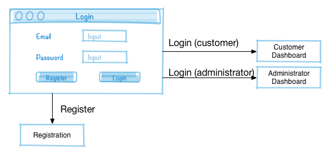
</td>
<td width="50%" valign="top">
A user account is required to access the system, so the database must maintain user account information such as a user's name and email address. Some users will have administrative rights to the system in order to add and edit train information -- including cancellations due to les grèves (strikes) -- and get passenger manifests.
</td>
</tr>
</table>

### Registration

<table>
<tr>
<td width="50%" valign="top">
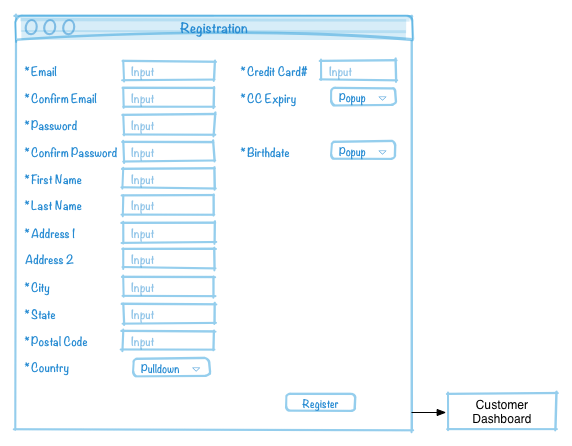
</td>
<td width="50%" valign="top">
Items marked with a * are required.
Email is unique. Credit card is unique.
</td>
</tr>
</table>

### Administrator Dashboard

<table>
<tr>
<td width="50%" valign="top">
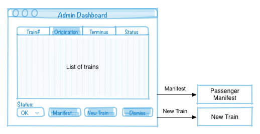
</td>
<td width="50%" valign="top">
Admin can create new train routes, see passenger manifests, and set the status of a train. When the CGT strikes they cancel particular trains for particular dates. The administrator can set the status of certain trains as canceled due to strike for specific dates, which will be reflected on all affected customer trip reports.
</td>
</tr>
</table>

### New Train (Route)

<table>
<tr>
<td width="50%" valign="top">
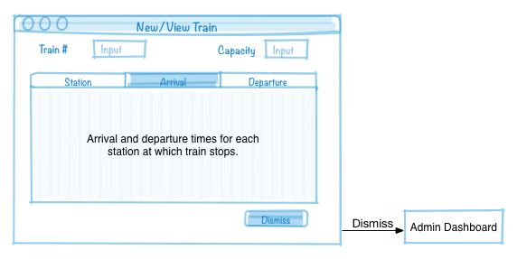
</td>
<td width="50%" valign="top">
Train number is unique. Note that train number is like a flight number -- it identifies a route, not a specific physical train. Each train runs daily. For simplicity we will stipulate that all trains begin and end their routes within a single day. A train originates at a station at a time, makes zero or more stops at other stations, and terminates at a station. Passengers may embark or disembark at any stop. Distance may be modeled as distance between stations or distance of a stop from origin (think about which approach simplifies calculations).
</td>
</tr>
</table>

### Passenger Manifest

<table>
<tr>
<td width="50%" valign="top">
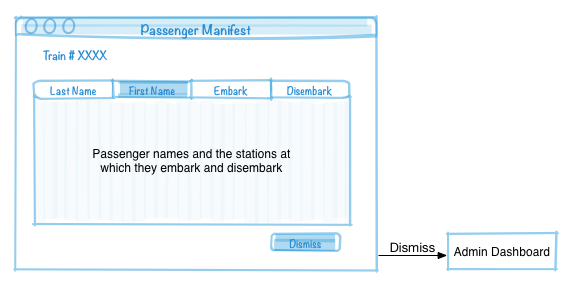
</td>
<td width="50%" valign="top">
Admin can select legs of a route and see passenger manifest for those legs. A leg is a segment of a train's route between two stops.
</td>
</tr>
</table>

### Customer Dashboard

<table>
<tr>
<td width="50%" valign="top">
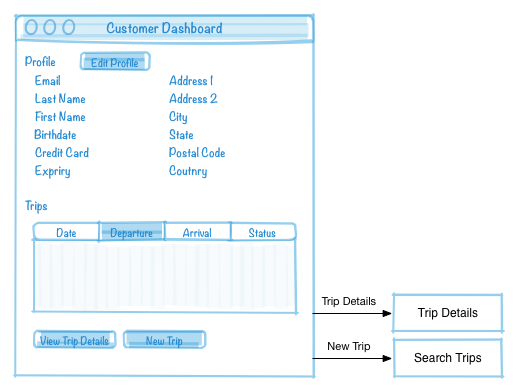
</td>
<td width="50%" valign="top">
Profile information, list of all future trips currently booked, and list of previous trips with prices paid. Status of each upcoming trip shows OK or Cancellations if any legs of the trip are affected by a strike. Viewing trip details shows all legs of trip and which legs are canceled due to strike, if applicable. Trip can then be re-routed at no additional charge.
</td>
</tr>
</table>

### Search Trips

<table>
<tr>
<td width="50%" valign="top">
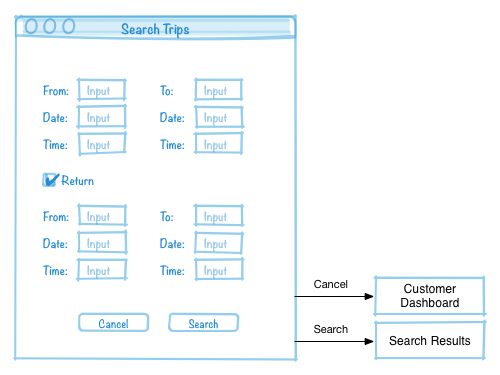
</td>
<td width="50%" valign="top">
Search trips is where you search for and select the out-bound and (optionally) return portion of a trip. A trip may be direct or may include one change of train.
</td>
</tr>
</table>

### Search Results

<table>
<tr>
<td width="50%" valign="top">
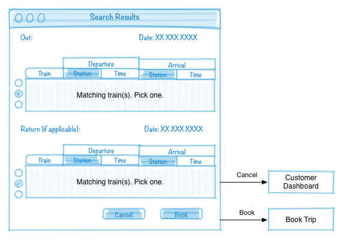
</td>
<td width="50%" valign="top">
Customer selects out-bound trip and optionally the return trip, each of which may include one change of train.
</td>
</tr>
</table>

### Book Trip

<table>
<tr>
<td width="50%" valign="top">
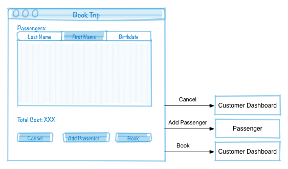
</td>
<td width="50%" valign="top">
Book trip is where you add passenger information and pay. Clicking "Book" charges the credit card on file for the customer. Base price is .1 € per kilometer. The price is reduced by 10% for 18-25 year old passengers and 15% for passengers under 18.
</td>
</tr>
</table>

### Enter Passenger Information

<table>
<tr>
<td width="50%" valign="top">
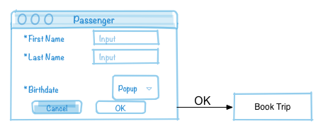
</td>
<td width="50%" valign="top">
The first passenger must be the user who is booking the trip. Other passengers don't need to have accounts.
</td>
</tr>
</table>

### Trip Details

<table>
<tr>
<td width="50%" valign="top">
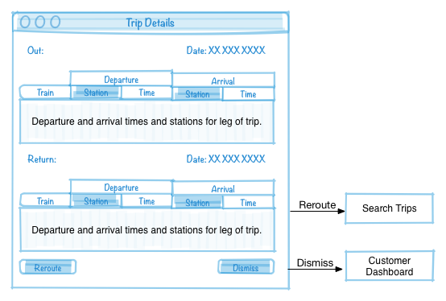
</td>
<td width="50%" valign="top">
If any of the legs are canceled due to a strike, the trip may be rerouted.
</td>
</tr>
</table>
