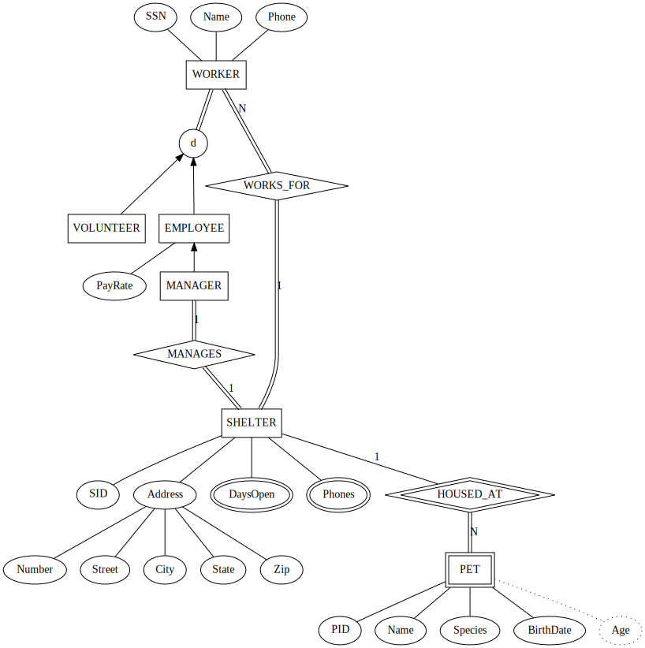
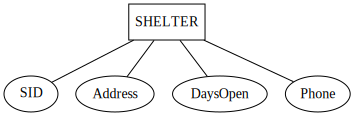
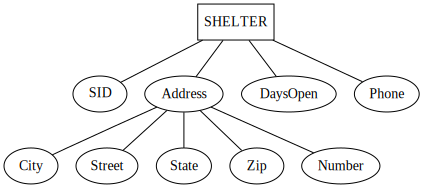
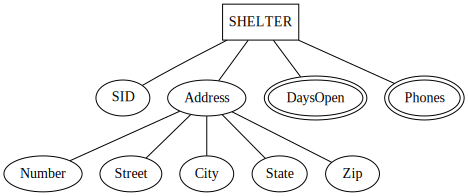
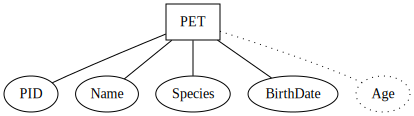
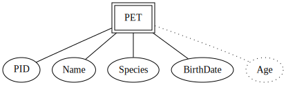

% Entity-Relationship Models
% CS 4400

# Entity-Relationship Models

- Entities
- Attributes
- Relationships

<!---------------------------------- Slide ---------------------------------->
# The Role of Conceptual Models

High-level but concrete view of data understandable by end users and database developers

<!---------------------------------- Slide ---------------------------------->
# Database Design Process

ER modeling is the box labeled "Conceptual Design."

<!---------------------------------- Slide ---------------------------------->
# Humane Society Data Specification

Here's an initial data specification provided by the humane society staff:

- A shelter has an address, a phone number, and days on which it is open.

- A worker has a social security number, a name, an address, and a phone number. A worker works for a shelter.

- A pet has an id number that's unique to its shelter, a name, a birth date, and a species.

<!---------------------------------- Slide ---------------------------------->
# Pet Shelter ER Model

By the time we're done iterating with the humane society staff, we'll arrive at this data model:

<!---------------------------------- Slide ---------------------------------->
# Entities and Entity Types

An entity is a real or abstract thing with an independent existence in the world.

- Person (real)
- Building (real)
- Job (abstract)
- Course (abstract)

In ER models we often say "entity" when we mean "entity type."

An entity type is a set of entities (instances) with the same attributes, i.e., properties of entities

<!---------------------------------- Slide ---------------------------------->
# Shelter, v1

Initial design of the shelter entity type based on initial spec from customer:

SID is underlined because it is a key - an SID uniquely identifies a shelter.

A shelter instance would look like:

`<1001, "981 Howell Mill Rd NW, Atlanta, GA 30318",`
`"MWF", "404-875-5331">`

What if we want to find all the shelters in Atlanta?

<!---------------------------------- Slide ---------------------------------->
# Shelter, v2

A composite attribue is composed of other attributes:

Can refer to address as a whole, or any (sub)attribute of address.

What if shelter has multiple phone numbers?

<!---------------------------------- Slide ---------------------------------->
# Shelter, v3

An attribute can have a set of values instead of a single value:

Note that we changed `DaysOpen` to multi-valued as well.

Now a shelter instance would look like:

A shelter instance would look like:

`< 1001, Address("981 Howell Mill Rd NW", "Atlanta", "GA", "30318"),`
`{M, W, F}, {"404-875-5331", "404-875-5332"} >`

<!---------------------------------- Slide ---------------------------------->
# Worker Entity Type

Given the following specification, create an ER model for `Worker`.

-

<!---------------------------------- Slide ---------------------------------->
# Pet, v1

Initial design of Pet entity type

Age is a derived attribute (not stored). BirthDate is stored, Age is calculated from BirthDate.

PID is unique only within a shelter. How do we unitquely identify a pet?

<!---------------------------------- Slide ---------------------------------->
# Weak Entity Types

<!---------------------------------- Slide ---------------------------------->
# Weak Entity Types

- Don't have key(s)
- Has partial key(s)
- Must have total participation with identifying entity type
- Identifiable by a composite key: identifying entity's key + weak entity's partial key

<!---------------------------------- Slide ---------------------------------->
# Pet, v2

PID (pet ID) is a partial key, and PET is a weak entity.

We have a partial key, but we still need an identifying relationship.

<!---------------------------------- Slide ---------------------------------->
# Atomic and Composite Attributes

- Atomic attributes, e.g., `Birthdate`

- Composite attributes, e.g., `Name`

<!---------------------------------- Slide ---------------------------------->
# Attributes (2)

- Single-valued, e.g.,

- Multi-valued, e.g.,

<!---------------------------------- Slide ---------------------------------->
# Attributes (3)

- Stored, e.g.,

- Derived, e.g.,

<!---------------------------------- Slide ---------------------------------->
# Attributes (4)

- Complex attributes

- NULL values

<!---------------------------------- Slide ---------------------------------->
# Entity Sets

<!---------------------------------- Slide ---------------------------------->
# Keys

<!---------------------------------- Slide ---------------------------------->
# Domains/Value Sets

<!---------------------------------- Slide ---------------------------------->
# First Draft of Department ER Model

Specification:

-

ER Model:

<!---------------------------------- Slide ---------------------------------->
# First Draft of Project ER Model

Specification:

-

ER Model:

<!---------------------------------- Slide ---------------------------------->
# First Draft of Employee ER Model

Specification:

-

ER Model:

<!---------------------------------- Slide ---------------------------------->
# First Draft of Dependent ER Model

Specification:

-

ER Model:

<!---------------------------------- Slide ---------------------------------->
# Relationship Types

A.K.A. Relationship sets

<!---------------------------------- Slide ---------------------------------->
# Relationship Instances

<!---------------------------------- Slide ---------------------------------->
# Relationship Degree

<!---------------------------------- Slide ---------------------------------->
# Relationships as Attributes

<!---------------------------------- Slide ---------------------------------->
# Recursive Relationships

<!---------------------------------- Slide ---------------------------------->
# Binary Relationship Constraints

- Cardinality ratios

- Participation constraints

<!---------------------------------- Slide ---------------------------------->
# Cardinality Ratios

<!---------------------------------- Slide ---------------------------------->
# Participation Constraints

- Total (existence): every entity in an entity set participates in a relationship

- Partial: some of the entities in an antity set participate in a relationship

<!---------------------------------- Slide ---------------------------------->
# Attributes of Relationship Types

<!---------------------------------- Slide ---------------------------------->
# Weak Entity Types

<!---------------------------------- Slide ---------------------------------->
# Weak Entity Types

- Don't have keys
- Has partial keys
- Must have total participation with identifying entity type
- Identifiable by a composite key: identifying entity's key + weak entity's partial key

<!---------------------------------- Slide ---------------------------------->
# Pet

- A pet has an id number that's unique to its shelter, a name, a birth date, and a species.

<!---------------------------------- Slide ---------------------------------->
# Composite Partial Keys

Source: [http://www.georgeforeman.com/family_man](http://www.georgeforeman.com/family_man)

<!---------------------------------- Slide ---------------------------------->
# George Foreman I, II, ...

Natalie Foreman
Michi Foreman
Leona Foreman
Freeda George Foreman
George Edward Foreman Jr
George Edward Foreman III
George Edward Foreman IV
George Edward Foreman V
George Edward Foreman VI
Georgetta Foreman