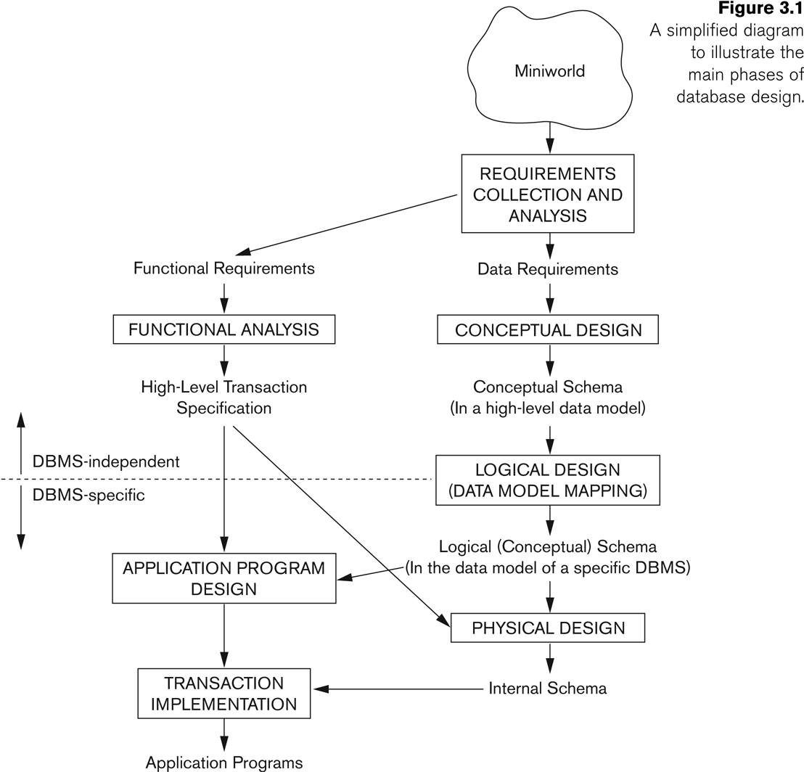
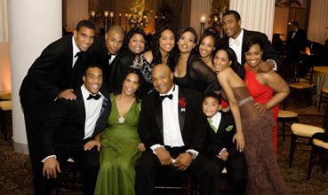

% Entity-Relationship Models
% CS 4400

# Entity-Relationship Models

- Entities
- Attributes
- Relationships

<!---------------------------------- Slide ---------------------------------->
# The Role of Conceptual Models

High-level but concrete view of data understandable by clients and database developers

<!---------------------------------- Slide ---------------------------------->
# Database Design Process

<!---------------------------------- Slide ---------------------------------->
# Company Data Specification

-

<!---------------------------------- Slide ---------------------------------->
# Company ER Model

<!---------------------------------- Slide ---------------------------------->
# Entities and Entity Types

An entity is a real or abstract thing with an independent existence in the world.

- Person (real)
- Building (real)
- Job (abstract)
- Course (abstract)

Entity types are like classes, entities are like instances of classes.

In ER models we often say "entity" when we mean "entity type."

Entities have attributes, i.e., properties of entities

<!---------------------------------- Slide ---------------------------------->
# Attributes (1)

- Atomic attributes, e.g., `Birthdate`

- Composite attributes, e.g., `Name`

<!---------------------------------- Slide ---------------------------------->
# Attributes (2)

- Single-valued, e.g.,

- Multi-valued, e.g.,

<!---------------------------------- Slide ---------------------------------->
# Attributes (3)

- Stored, e.g.,

- Derived, e.g.,

<!---------------------------------- Slide ---------------------------------->
# Attributes (4)

- Complex attributes

- NULL values

<!---------------------------------- Slide ---------------------------------->
# Entity Sets

<!---------------------------------- Slide ---------------------------------->
# Keys

<!---------------------------------- Slide ---------------------------------->
# Domains/Value Sets

<!---------------------------------- Slide ---------------------------------->
# First Draft of Department ER Model

Specification:

-

ER Model:

<!---------------------------------- Slide ---------------------------------->
# First Draft of Project ER Model

Specification:

-

ER Model:

<!---------------------------------- Slide ---------------------------------->
# First Draft of Employee ER Model

Specification:

-

ER Model:

<!---------------------------------- Slide ---------------------------------->
# First Draft of Dependent ER Model

Specification:

-

ER Model:

<!---------------------------------- Slide ---------------------------------->
# Relationship Types

A.K.A. Relationship sets

<!---------------------------------- Slide ---------------------------------->
# Relationship Instances

<!---------------------------------- Slide ---------------------------------->
# Relationship Degree

<!---------------------------------- Slide ---------------------------------->
# Relationships as Attributes

<!---------------------------------- Slide ---------------------------------->
# Recursive Relationships

<!---------------------------------- Slide ---------------------------------->
# Binary Relationship Constraints

- Cardinality ratios

- Participation constraints

<!---------------------------------- Slide ---------------------------------->
# Cardinality Ratios

<!---------------------------------- Slide ---------------------------------->
# Participation Constraints

- Total (existence): every entity in an entity set participates in a relationship

- Partial: some of the entities in an antity set participate in a relationship

<!---------------------------------- Slide ---------------------------------->
# Attributes of Relationship Types

<!---------------------------------- Slide ---------------------------------->
# Weak Entity Types

<!---------------------------------- Slide ---------------------------------->
# Composite Partial Keys

Source: [http://www.georgeforeman.com/family_man](http://www.georgeforeman.com/family_man)

<!---------------------------------- Slide ---------------------------------->
# George Foreman I, II, ...

Natalie Foreman
Michi Foreman
Leona Foreman
Freeda George Foreman
George Edward Foreman Jr
George Edward Foreman III
George Edward Foreman IV
George Edward Foreman V
George Edward Foreman VI
Georgetta Foreman