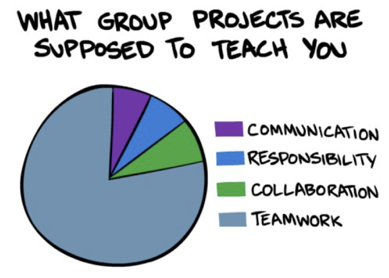
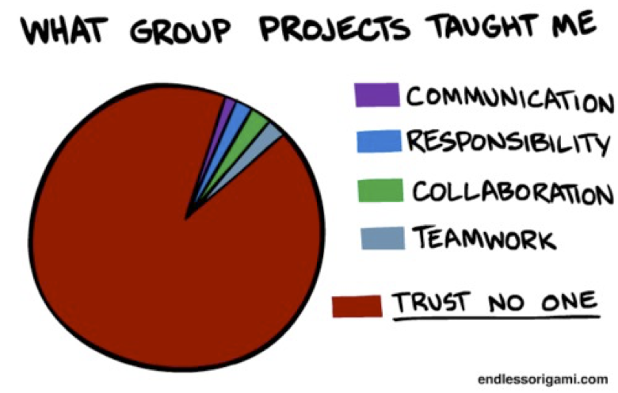

% Introduction to CS 4400

# Course Overview

- Syllabus
- Schedule
- Software
- Project

# Team Project Ideal

# Team Project Reality

# Team Formation Considerations

- Technology preferences (OS, language, etc.)
- Expertise (build management, VCS, UI design)
- Personal factors (schedule compatibility, personalities)
